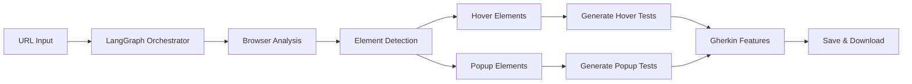

# 🚀 BDD Test Generator - Quick Start Guide

## AI-Powered Gherkin Feature Generator for Interactive UI Testing

### 🎯 What This Tool Does
Automatically generates Gherkin BDD test scenarios for:
- **Hover Interactions** (dropdown menus, tooltips, navigation)
- **Popup/Modal Testing** (forms, confirmations, overlays)
- **Dynamic UI Elements** detection and test generation

**Powered by LangGraph orchestration with real-time WebSocket updates**

---

## ⚡ Get Started in 5 Minutes

### 1. Prerequisites Check
```bash
# Verify Python version (3.8+ required)
python --version

# Verify pip is installed
pip --version
```

### 2. Install Dependencies
```bash
# Install Python packages
pip install fastapi uvicorn playwright groq openai anthropic colorlog pydantic python-dotenv beautifulsoup4 langgraph

# Install Playwright browsers (required for web automation)
playwright install chromium
```

### 3. Configure Environment
```bash
# Create environment file from template
cp _env .env

# Edit .env with your API keys
nano .env  # or use your preferred editor
```

**Minimum .env configuration:**
```env
# LLM Provider Settings
GROQ_API_KEY=your_groq_api_key_here
LLM_PROVIDER=groq
LLM_MODEL=openai/gpt-oss-20b
LLM_TEMPERATURE=0.1
MAX_TOKENS=3000

# Optional: Additional providers
OPENAI_API_KEY=your_openai_key_here
ANTHROPIC_API_KEY=your_claude_key_here
```

### 4. Start Application
```bash
# Recommended: Use startup script (includes environment validation)
python start.py

# Alternative: Direct FastAPI run
python app.py
```

The startup script will:
- ✅ Validate Python version
- ✅ Check dependencies
- ✅ Verify API keys
- ✅ Install Playwright browsers
- ✅ Create necessary directories
- 🚀 Start the FastAPI server

### 5. Access Application
**Open your browser:** http://localhost:5000

**API Documentation:** http://localhost:5000/api/docs

---

## 🎮 Generate Your First Tests

### Step-by-Step Process:

1. **Enter Target URL**
   ```
   Example: https://www.apple.com/
   ```

2. **Configure Settings**
   - **LLM Provider:** Groq (default, free tier)
   - **Model:** openai/gpt-oss-20b (recommended)
   - **Browser Mode:** Headless (default)
   - **Temperature:** 0.3 (balance creativity/consistency)

3. **Start Generation**
   - Click **🚀 Generate Tests**
   - Monitor real-time progress via WebSocket
   - Watch LangGraph workflow execution

4. **Review Results**
   - View generated Gherkin features
   - Download `.feature` files
   - Check execution logs

### 📊 What Happens During Generation:



---

## 🌐 Recommended Test URLs

### E-commerce Sites:
- `https://www.nike.com/` - Rich navigation menus
- `https://www.apple.com/` - Product hover effects
- `https://www.amazon.com/` - Complex dropdowns


### Healthcare/Pharma:
- `https://www.tivdak.com/patient-stories/` - Patient portals
- `https://www.merck.com/` - Complex navigation

---

## 🔧 Configuration Options

### LLM Providers & Models:

**Groq (Free Tier - Recommended)**
```env
GROQ_API_KEY=your_key
LLM_PROVIDER=groq
LLM_MODEL=openai/gpt-oss-20b        # Best for test generation
LLM_MODEL=llama-3.1-70b-versatile   # More detailed analysis
LLM_MODEL=llama-3.1-8b-instant      # Fastest generation
```

**OpenAI**
```env
OPENAI_API_KEY=your_key
LLM_PROVIDER=openai
LLM_MODEL=gpt-4-turbo-preview        # Highest quality
LLM_MODEL=gpt-3.5-turbo              # Cost effective
```

**Claude (Anthropic)**
```env
ANTHROPIC_API_KEY=your_key
LLM_PROVIDER=claude
LLM_MODEL=claude-3-5-sonnet-20241022  # Latest model
LLM_MODEL=claude-3-opus-20240229      # Most capable
```

### Browser Settings:
```env
# Browser automation
HEADLESS=true               # Run without GUI
TIMEOUT=30000              # Page load timeout (ms)
VIEWPORT_WIDTH=1920        # Browser width
VIEWPORT_HEIGHT=1080       # Browser height
SLOW_MO=100               # Slow down for debugging
```

---

## 📁 Project Structure

```
bdd-test-generator/
├── app.py                 # FastAPI application
├── start.py               # Startup validation script
├── orchestrator.py        # LangGraph workflow
├── core/
│   ├── config.py         # Configuration management
│   ├── database.py       # SQLite operations
│   ├── browser.py        # Playwright automation
│   ├── gherkin_generator.py # Test generation
│   ├── llm_provider.py   # LLM abstraction
│   └── logger.py         # Logging system
├── outputs/              # Generated .feature files
├── logs/                 # Application logs
├── templates/            # Web interface
├── static/               # CSS/JS assets
└── bdd_tests.db         # SQLite database
```

---

## 🐛 Troubleshooting

### Common Issues:

**❌ "No API key found"**
```bash
# Check .env file exists
ls -la .env
# Verify key is set
cat .env | grep GROQ_API_KEY
# Restart application
python start.py
```

**❌ "Playwright browsers not installed"**
```bash
# Install browsers
playwright install chromium
# Verify installation
playwright --version
```

**❌ "Port 5000 already in use"**
```bash
# Kill process using port
sudo lsof -ti:5000 | xargs kill -9
# Or change port in .env
echo "PORT=8000" >> .env
```

**❌ "Module not found"**
```bash
# Install missing dependencies
pip install -r requirements.txt
# Check Python path
python -c "import sys; print(sys.path)"
```

**❌ "Database locked"**
```bash
# Remove database file
rm bdd_tests.db
# Restart application (will recreate)
python start.py
```

---

## 🔑 Getting API Keys

### 1. Groq (Free - Recommended for Getting Started)
- **Website:** https://console.groq.com/
- **Steps:**
  1. Sign up for free account
  2. Navigate to API Keys section
  3. Create new key
  4. Copy to `.env` file
- **Benefits:** Fast inference, generous free tier

### 2. OpenAI (Paid)
- **Website:** https://platform.openai.com/
- **Steps:**
  1. Create account
  2. Add billing information
  3. Generate API key
  4. Set as `OPENAI_API_KEY`
- **Benefits:** High quality outputs, proven reliability

### 3. Anthropic Claude (Paid)
- **Website:** https://console.anthropic.com/
- **Steps:**
  1. Sign up for account
  2. Complete verification
  3. Generate API key
  4. Set as `ANTHROPIC_API_KEY`
- **Benefits:** Excellent reasoning, safety-focused

---

## 📊 Monitoring & Debugging

### Real-Time Monitoring:
- **WebSocket Updates:** Live progress in browser
- **LangGraph Workflow:** State machine visualization
- **Task History:** `/api/tasks` endpoint
- **Logs:** `logs/bdd_generator_YYYYMMDD.log`

### API Endpoints:
```bash
# Health check
curl http://localhost:5000/api/health

# Get all tasks
curl http://localhost:5000/api/tasks

# Get task details
curl http://localhost:5000/api/task/{task_id}

# Download feature file
curl http://localhost:5000/api/download/{task_id}/{feature_type}
```

### Database Inspection:
```bash
# View SQLite database
sqlite3 bdd_tests.db
.tables
SELECT * FROM test_tasks;
```

---

## 🎨 Generated Test Examples

### Hover Interaction Tests:
```gherkin
Feature: Validate navigation menu functionality

Scenario: Verify Products navigation menu dropdown appears on hover
  Given the user is on the "https://www.apple.com/" page
  When the user hovers over the navigation menu "Products"
  Then a dropdown menu should appear
  And the menu should contain clickable options

Scenario: Verify navigation through Products dropdown menu
  Given the user is on the "https://www.apple.com/" page
  When the user hovers over the navigation menu "Products"
  And clicks the link "iPhone" from the dropdown
  Then the page URL should change to the iPhone page
```

### Popup/Modal Tests:
```gherkin
Feature: Validate "Sign Up" pop-up functionality

Scenario: Verify the cancel button in the pop-up
  Given the user is on the "https://example.com/" page
  When the user clicks the "Sign Up" button
  Then a pop-up should appear with the title "Create Account"
  And the user clicks the "Cancel" button
  Then the pop-up should close and the user should remain on the same page

Scenario: Verify the continue button in the pop-up
  Given the user is on the "https://example.com/" page
  When the user clicks the "Sign Up" button
  Then a pop-up should appear with the title "Create Account"
  And the user clicks the "Continue" button
  Then the page should navigate or perform the expected action
```

---

## 🚀 Advanced Usage

### Custom LLM Configuration:
```python
# Via API
POST /api/generate
{
    "url": "https://example.com",
    "llm_provider": "groq",
    "llm_model": "llama-3.1-70b-versatile",
    "temperature": 0.2,
    "max_tokens": 4000,
    "headless": true,
    "timeout": 45000
}
```

### Batch Processing:
```python
# Multiple URLs
urls = [
    "https://site1.com",
    "https://site2.com",
    "https://site3.com"
]

for url in urls:
    # Generate tests for each URL
    # Monitor via WebSocket
    # Download results
```


---

## ✅ Success Checklist

- [ ] Python 3.8+ installed and verified
- [ ] All dependencies installed (`pip install -r requirements.txt`)
- [ ] Playwright browsers installed (`playwright install chromium`)
- [ ] `.env` file created with valid API key
- [ ] Application starts without errors (`python start.py`)
- [ ] Browser opens successfully at http://localhost:5000
- [ ] First test generation completed successfully
- [ ] Generated `.feature` files downloaded
- [ ] WebSocket real-time updates working
- [ ] API documentation accessible


## 📚 Additional Resources

- **API Documentation:** http://localhost:5000/api/docs
- **WebSocket Events:** Real-time progress monitoring
- **Log Analysis:** Check `logs/` directory for detailed execution logs
- **Database Schema:** Inspect SQLite database for task history
- **LangGraph Workflow:** Monitor state machine execution

---
